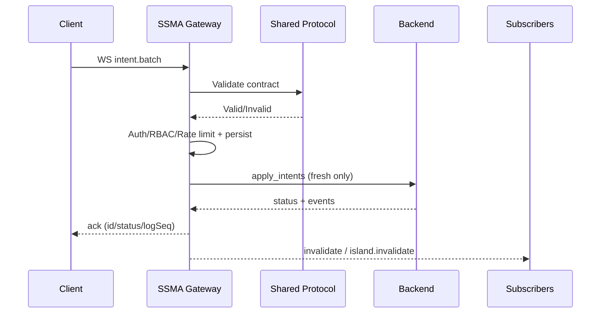

# SSMA Monorepo

SSMA (Stable State Middleware Architecture) is a gateway-focused backend architecture:

- It is the sync authority for optimistic client traffic.
- It validates protocol contracts and enforces security policy.
- It forwards accepted writes/queries to a backend adapter.
- It emits WS/SSE acknowledgements and invalidations to clients.

This repository contains both runtime implementations and one shared protocol package.

## Repository Structure

- `apps/ssma-js`: Node.js runtime implementation
- `apps/ssma-rust`: Rust runtime implementation
- `packages/ssma-protocol`: shared contracts and golden vectors
- `docs`: architecture, protocol, security, operations, testing docs
- `tooling`: repository-level tools/scripts

## How It Works

1. Client sends `intent.batch` (WS) or a supported HTTP operation.
2. Gateway validates schema and security policy.
3. Gateway persists intent and enforces idempotency/replay semantics.
4. Gateway forwards fresh intents to backend adapter.
5. Gateway emits ACK + invalidation events to WS/SSE clients.



## Quick Start

### Use Without CLI (Current Recommended Path)

Run from this monorepo directly.

### JS Runtime

```bash
npm --prefix apps/ssma-js run dev
```

### Rust Runtime

```bash
cd apps/ssma-rust
cargo run
```

### Use With CLI (When `csma-ssma-cli` is available)

Scaffold first, then run runtime commands in generated project:

```bash
csma-ssma
cd <your-project>
npm run dev:ssma
```

## Template IDs (CLI Source of Truth)

The CLI should discover templates from `templates/*/template.manifest.json`.

- `ssma-js-gateway`: SSMA JS runtime template
- `ssma-rust-gateway`: SSMA Rust runtime template

Validate template metadata:

```bash
npm run validate:templates
```

## Repository Policy

This repository is template-first source.

- Keep runtime source, protocol contracts, docs source, and minimal examples.
- Do not commit generated/runtime artifacts (`node_modules`, Rust `target`, logs, `.old/`).

## Validation Commands

From repo root:

- JS tests: `npm run test:js`
- JS conformance vectors: `npm run test:conformance`
- Docs link check: `npm run check:docs`
- Rust tests: `npm run test:rust`

Direct commands:

- JS app: `npm --prefix apps/ssma-js run <script>`
- Rust app: `cd apps/ssma-rust && cargo <command>`
